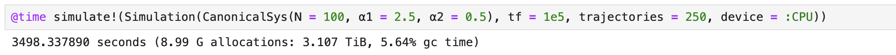
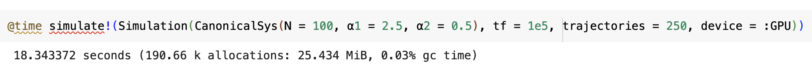

# MultimodeSelforganization.jl

This repository contains a GPU-accelerated Julia implementation of the code and data necessary for recreating the figures in the publications

*Quenches across the self-organization transition in multimode cavities*  
T. Keller, V. Torggler, S. Jäger, S. Schütz, H. Ritsch, and G. Morigi  
New J. Phys. **20** 025004 (2018).  [doi: 10.1088/1367-2630/aaa161](https://doi.org/10.1088/1367-2630/aaa161)

as well as

*Phases of cold atoms interacting via photon-mediated long-range forces*  
 T. Keller, S. Jäger, and G. Morigi  
J. Stat. Mech. 064002 (2017). [doi: 10.1088/1742-5468/aa71d7](https://doi.org/10.1088/1742-5468/aa71d7)

## Physical Model
We consider a system of $N$ particles interacting with two commensurate modes $\sim\cos(kx)$ and $\sim\cos(2kx)$ of an optical cavity with wave vector $k=2\pi/\lambda$. Each mode is driven by lasers with a certain strength $\alpha_n$.
As in the paper we focus on the case in which the cavity detunings match the cavity decay rate so that $\Delta_c = -\kappa$ and use dimensionless units for positions $x$ $[k^{-1}]$, momenta $p$ $[\hbar k]$, energy $E$ $[\hbar\omega_\mathrm{rec}]$ and time $t$ $[\kappa^{-1}]$.

In a semi-classical regime the system is then described by the following set of $2N$ stochastic differential equations (SDEs) for the positions and momenta 

$$
\begin{align}
  dx_i &= 2\frac{\omega_\mathrm{rec}}{\kappa}p_idt\\
  dp_i &=  -\sum_{n=1,2} n\alpha_n\left(\theta_n + 2n\frac{\omega_\mathrm{rec}}{\kappa}\chi_n\right)\sin(nx_i)dt + dW_i^1 + dW_i^2  ,
  %\label{eq:SDE}
\end{align}
$$

where $\omega_\mathrm{rec}$ is the recoil frequency. 
The order parameters $\theta_n$ describing the degree of organization with respect to a cavity mode and the drag parameters $\chi_n$ are given by

$$
\theta_n = \frac{1}{N}\sum_{i=1}^N\cos(nx_i) \quad\mathrm{and}\quad \chi_n = \frac{1}{N}\sum_{i=1}^Np_i\sin(nx_i) 
$$

respectively. The Wiener processes $dW$ fulfill the relation $\langle dW_i^ndW_j^m\rangle = 2D_{ij}^n\delta_{nm}dt$ where

$$
D_{ij}^n = n^2\frac{\alpha_n}{N}\sin(nx_i)\sin(nx_j) .
$$

## Numerical Algorithm 
Due to the long-range interactions in the system, the evolution to a thermal steady-state occurs in different stages spread over several orders of magnitude, which seems to pose a problem even for advanced numerical solvers like the excellent [DifferentialEquations.jl](https://docs.sciml.ai/DiffEqDocs/stable/) package.

We therefore use a stochastic Heun method with fixed time-step according to

$$
\begin{align}
    \bar{u}(t + \Delta t) &= u(t) + a(t,u)\Delta t + b(t,u)\Delta W\\
    u(t + \Delta t) &= u(t) + \frac{\Delta t}{2}\left[a(t,u) + a(t+\Delta t,\bar{u})\right] + b(t,u)\Delta W
\end{align}
$$

with drift vector $a(t,u)$, diffusion matrix $b(t,u)$, intermediate time-step $\bar{u}(t+\Delta t)$ and (in our case) two-dimensional Wiener process $\Delta W$, combining the the positions and momenta like $u :=(x_1,\ldots,x_N,p_1,\ldots,p_N)$.

The observables of interest are only calculated at pre-defined logarithmically spaced intervals to account for the different time-scales of the system.

## Performance 

The structure of the SDEs describing the system is very suitable for a parallelized solution on a GPU. 
We assign one GPU thread per particle for calculating its set of two equations and further group all N threads of a system into a block. Each block represents an independent trajectory of the SDE solution.
By running several blocks simultaneously we can also parallelize the repetition of the SDE solution necessary for statistical significance of the results.   

Simulating a typical system size of $N=100$ particles and 250 trajectories, i.e. a total of 50,000 SDEs, results in the following benchmarks

- CPU performance on a MacbookPro M1 Max

- GPU performance on a Nvidia A100 

Running the simulations on a GPU provides a **190 x speed-up** in this case.
Note that a bottleneck for the increase is the sum that needs to be performed across all threads in a block when calculating the order parameters and also the number of available blocks on the device for parallelizing SDE trajectories. 
Of course the CPU version could also be parallelized to some degree using different CPU threads and it is also likely not as optimized as it could be.  